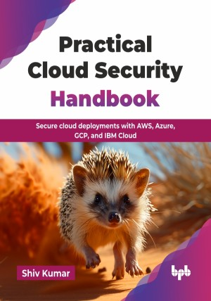

# Practical Cloud Security Handbook

Secure cloud deployments with AWS, Azure, GCP, and IBM Cloud.

This is the repository for [Practical Cloud Security Handbook
](https://bpbonline.com/products/practical-cloud-security-handbook?variant=44704015745224),published by BPB Publications.

## About the Book
As organizations rapidly migrate to cloud environments, robust cloud security is no longer optional—it is paramount. The Practical Cloud Security Handbook is your essential guide to navigating this complex landscape, empowering you to secure digital assets effectively and confidently in the era of distributed systems and cloud-native architectures.

This handbook systematically guides you from cloud security fundamentals, including the shared responsibility model, through various cloud-native architectural patterns and top cloud workloads like IAM, VPC, and containerization. You will gain a deep understanding of core security concepts, such as encryption and protocols, and then explore the practical, multi-cloud configurations for securing storage, network services, and identity access management across AWS, Azure, IBM, and GCP. The book progresses to vital operational security aspects like monitoring, encryption application, and robust testing. It further explores modern approaches like security as code, offering best practices for both cloud-native and non-cloud-native implementations, integrates DevSecOps principles, and concludes with crucial compliance and regulatory considerations.

Upon completing this handbook, you will possess a comprehensive, hands-on understanding of cloud security, enabling you to design, implement, and maintain secure cloud environments and confidently address today's complex cybersecurity challenges.

## What You Will Learn
• Secure workloads across AWS, Azure, GCP, and IBM.

• Implement Zero Trust security architectures.

• Use infrastructure as code for secure deployments.

• Set up DevSecOps pipelines with Jenkins and GitHub.

• Explore  IAM, encryption, and network security controls.

• Detect and respond to security breaches effectively.

• Apply DevSecOps, Zero Trust, and compliance best practices.
